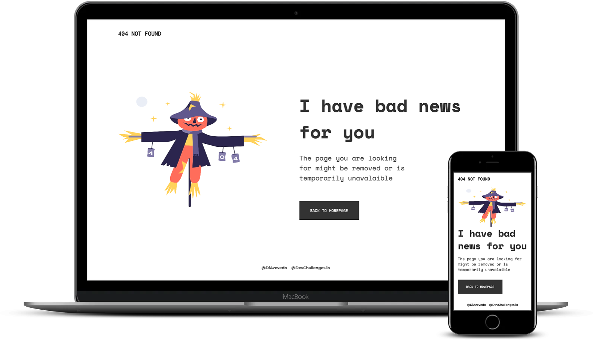

<!-- Please update value in the {}  -->

<h1 align="center">404 Not Found page</h1>

   Solution for a challenge from  <a href="http://devchallenges.io" target="_blank">Devchallenges.io</a>.

  <h3>
    <a href="https://not-found.diazevedo.com/">
      Demo
    </a>
     | 
    <a href="https://devchallenges.io/solutions/vkoaYARLcEVscrtO432r">
      Solution
    </a>
     | 
    <a href="https://devchallenges.io/challenges/wBunSb7FPrIepJZAg0sY">
      Challenge
    </a>
  </h3>

## Table of Contents

- [Overview](#overview)
  - [Built With](#built-with)
- [Features](#features)
- [Contact](#contact)

## Overview

A 404 not found page to practive HTML and CSS and responsive design.

### Built With

- HTML
- CSS

## Features

This application/site was created as a submission to a [DevChallenges](https://devchallenges.io/challenges) challenge. The [challenge](https://devchallenges.io/challenges/wBunSb7FPrIepJZAg0sY) was to build an application to complete the given user stories.

## Contact

- Linkedin [@diazevedo](https://www.linkedin.com/in/diazevedo/)
- GitHub [@diazevedo](https://github.com/diazevedo/)
